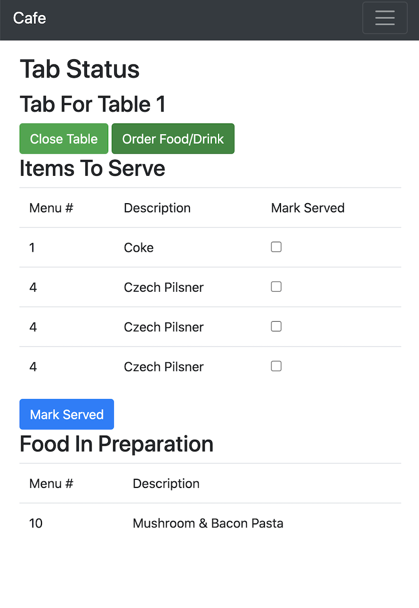
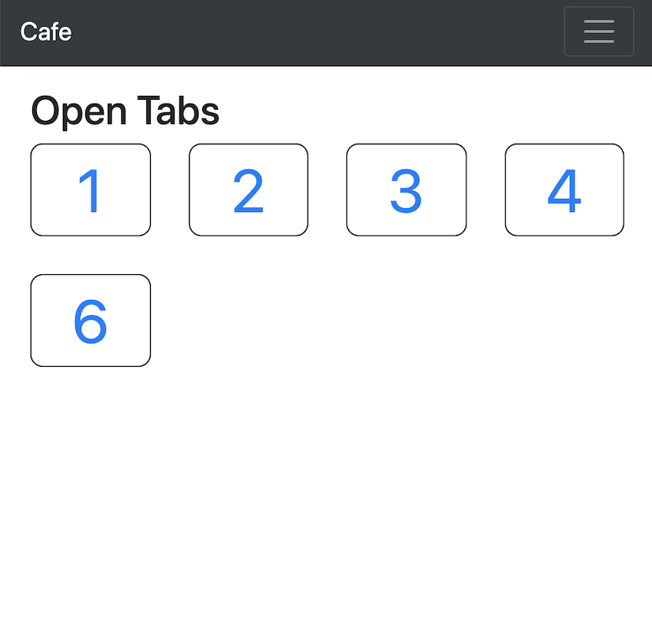

# Cafe Application

This is a working example of CQRS/ES on PHP. 
It's based on the well known C# CQRS.nu tutorial.
It uses EventSauce, but you can use any other ES package.   
The domain is related to a tab.

**It will take you less than 4 min to download and setup this app in your computer.** So enjoy!

### The Domain
We'll work in the cafe domain. Our focus will be on the concept of a **tab**, which tracks the visit 
of an individual or group to the cafe. When people arrive to the cafe and take a table, a tab is opened. They may then 
order drinks and food. Drinks are served immediately by the table staff, however food must be cooked by a chef. 
Once the chef has prepared the food, it can then be served.

During their time at the restaurant, visitors may order extra food or drinks. 
If they realize they ordered the wrong thing, they may amend the order - but not after the food and drink has been 
served to and accepted by them.

Finally, the visitors close the tab by paying what is owed, possibly with a tip for the serving staff. 
Upon closing a tab, it must be paid for in full. A tab with unserved items cannot be closed unless the items are either 
marked as served or cancelled first.

### Screenshots

### Requirements
- Docker 

### Installation
- Clone this repository: `git clone git@github.com:yourwebmaker/cqrs.nu-php.git`
- Start the containers: `make up`
- Install dependencies: `make install-dependencies`
- Setup database: `make migrations-run`
- Open your browser on `http://0.0.0.0:8001/tab/open`

### Usage
- See full commands list `make help`
- Access the container: `docker exec -it cafe-fpm bash`

### Testing
- Run command: `make test`